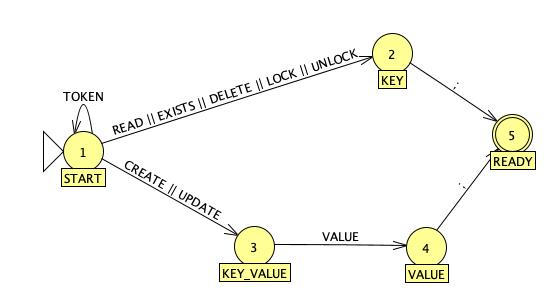

# Progetto Sistemi Distribuiti 2022-2023 - TCP

## PROTOCOLLO DATABASE

### Descrizione

Il protocollo di comunicazione con il database si basa su messaggi in formato stringa sia nelle richieste che nelle risposte. Nelle richieste è possibile specificare 8 comandi differenti che rappresentano: 4 operazioni CRUD, 2 operazioni per la composizione di operazioni in maniera concorrente e 2 operazioni di supporto. Le risposte hanno un formato simile per tutte le operazioni.

### Lista e formato comandi

1. `CREATE <KEY> <VALUE> ;`
2. `READ <KEY> ;`
3. `[TOKEN] UPDATE <KEY> <VALUE> ;`
4. `[TOKEN] DELETE <KEY> ;`
5. `EXISTS <KEY> ;`
6. `KEY_FILTER <FILTER> ;`
7. `<TOKEN> LOCK <KEYS> ;`
8. `<TOKEN> UNLOCK <KEYS> ;`

### Interpretazione dell'input

Per interpretare correttamente i comandi inviati dall'utente è previsto l'utilizzo di una macchina a stati finiti i cui stati sono rappresentati da interi. La macchina funziona come descritto dal seguente automa:

### Spiegazione operazioni

1. L'operazione `CREATE` si occupa di creare un entry nel database associando `<KEY>` e `<VALUE>` come coppia chiave-valore. Fallisce quando si prova a creare una coppia utilizzando una chiave già esistente. È implementata da un metodo `synchronized` per evitare la creazione simultanea di più valori con la stessa chiave.
2. L'operazione `READ` permette la lettura del valore data una chiave `<KEY>`. La richiesta fallisce quando non è presente entry con la chiave richiesta.
3. L'operazione `UPDATE` si occupa di aggiornare il valore di una entry con chiave `<KEY>` utilizzando il valore `<VALUE>`. L'operazione fallisce nel momento in cui la chiave non corrisponde a nessuna entry. Il comando riceve in input un `TOKEN` opzionale. Il token è una qualsiasi stringa. Il token è utilizzato per la composizione di operazioni esplicita permessa dalle operazioni `LOCK` e `UNLOCK`. Nel caso in cui non sia prevista composizione il comando chiama internamente `LOCK` per rendere l'esecuzione thread-safe. Nel caso in cui il `TOKEN`  non sia stato esplicitamente dichiarato, il metodo assegna un `TOKEN` token univoco temporaneo all'esecuzione. Ulteriori scenari di fallimento comportano la presenza di un `LOCK`  già precedentemente richiesto con un `TOKEN`  differente sulla `<KEY>` attuale.
4. L'operazione `DELETE` si occupa di cancellare il valore di una entry con chiave `<KEY>`. L'operazione fallisce nel momento in cui la chiave non corrisponde a nessuna entry. Il comando riceve in input un `TOKEN` opzionale. Il token è una qualsiasi stringa. Il token è utilizzato per la composizione di operazioni esplicita permessa dalle operazioni `LOCK` e `UNLOCK`. Nel caso in cui non sia prevista composizione esplicita il comando chiama internamente `LOCK` per rendere l'esecuzione thread-safe. Nel caso in cui il `TOKEN`  non sia stato esplicitamente dichiarato, il metodo assegna un `TOKEN` token univoco temporaneo all'esecuzione. Ulteriori scenari di fallimento comportano la presenza di un `LOCK`  già precedentemente richiesto con un `TOKEN`  differente sulla `<KEY>` attuale.
5. L'operazione `EXISTS` permette di controllare l'esistenza di una entry data la sua chiave. Non sono previsti scenari di fallimento. La risposta prevede un body contenente i valori `TRUE` o `FALSE` a seconda della presenza della entry.
6. L'operazione `KEY_FILTER` permette di restituire una lista di valori la cui chiave contiene la stringa `<FILTER>`. Il body della risposta prevede il ritorno dei valori separati dal carattere `--`,  se nessuna chiave contiene il `<FILTER>` il body di ritorno sarà vuoto. Non sono previsti scenari di fallimento.
7. L'operazione `LOCK` permette di dichiarare una lista di chiavi `<KEYS>`, espressa come una stringa con i singoli valori separati da `--`, sulla quale solamente i comandi (che lo richiedono) che passano `<TOKEN>` possono essere eseguiti. L'operazione permette allo sviluppatore di dichiare un'area "critica" sulla quale solamente un'insieme di metodi autorizzati può agire. L'operazione restituisce esito positivo se le chiavi risultano libere, altrimenti avviene un fallimento. È implementato da metodo `synchronized` per evitare che il `LOCK` venga acquisito contemporaneamente da più agenti.
8. L'operazione `UNLOCK` permette di liberare una lista di chiavi `<KEYS>`, espressa come una stringa con i singoli valori separati da `--`, da un `<TOKEN>` precedentemente assegnato. L'operazione restituisce esito positivo se le chiavi erano presenti nella tabella di blocco sotto la voce `<TOKEN>`, altrimenti avviene un fallimento. È implementato da metodo `synchronized` per evitare che più agenti eseguano `UNLOCK` contemporaneamente.

### Formato risposta

Il formato delle risposte è uguale per tutti i comandi ed è il seguente: `<OK> | <FAILED> [BODY] ;`.
Le risposte `<OK>` e `<FAILED>` sono mutualmente esclusive e chiaramente rappresentano la riuscita del comando. Il `[BODY]` è previsto solo dalle operazioni `READ`, `EXISTS` e `KEY_FILTER`.
